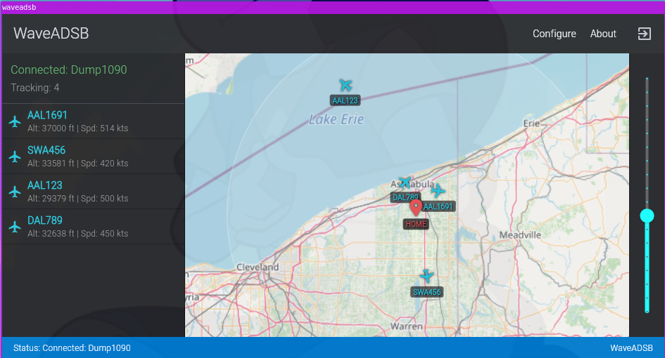

# WaveADSB

## Overview

WaveADSB is a simple, lightweight graphical map viewer for real-time ADS-B (Automatic Dependent Surveillance–Broadcast) aircraft data. It acts as a front-end for backend ADS-B decoders like `dump1090` that output data in the SBS-1 (BaseStation) format over a network connection.



Download a binary at https://sarahsforge.dev/products/waveadsb

## Features

* **Real-time Map:** Displays aircraft positions on an interactive map.
* **Aircraft List:** Shows a sortable list of currently tracked aircraft with basic details (callsign, altitude, speed).
* **SBS-1 Feed Support:** Connects to any TCP server providing data in SBS-1 format (like `dump1090 --net`).
* **Flight Path History:** Optionally displays the tracked path of aircraft since they were first detected.
* **Home Location:** Set a home location on the map to see range rings (50 NM, 100 NM).
* **Offline Maps:** Download map areas for offline use.
* **Customizable:** Configure data feeds and map display options.

## Basic Usage

WaveADSB requires an external program (like `dump1090`) to receive ADS-B signals (usually via an SDR dongle) and provide the decoded data over the network in SBS-1 format.

1.  **Start Your ADS-B Decoder:**
    Ensure your ADS-B decoder software is running and configured to output SBS-1 data over TCP. For `dump1090` (common on Raspberry Pi setups with an SDR), you typically run it with network options enabled:
    ```bash
    ./dump1090 --net
    ```
    This usually makes the data available on port `30003` of the machine running `dump1090`.

2.  **Run WaveADSB:**
    Launch the WaveADSB application.

3.  **Configure Feed:**
    * Click the **Configure** button in the top bar.
    * Select **Feeds** from the dropdown menu.
    * Click the **+** (Add) button.
    * Enter the connection details for your ADS-B decoder:
        * **Name:** A descriptive name (e.g., "Local Dump1090").
        * **IP Address / Hostname:** The IP address of the computer running `dump1090`. If it's the same computer as WaveADSB, use `127.0.0.1`.
        * **Port Number:** The port `dump1090` is using for SBS-1 output (usually `30003`).
    * Click **Save**.

4.  **View Aircraft:**
    WaveADSB will automatically attempt to connect to the configured feed. Once connected, you should see aircraft appear on the map and in the list on the left sidebar as they are detected by your backend decoder. The status bar at the bottom will indicate the connection status.

## Map Interaction

* **Pan:** Click and drag the map.
* **Zoom:** Use the mouse scroll wheel or the slider on the right sidebar.
* **Set Home:** Right-click (or long-press on touch devices) on the map to set your home location.
* **Aircraft Details:** Click on an aircraft icon on the map to view detailed information.
* **Center on Aircraft:** Click on an aircraft in the left sidebar list to center the map on it (if it has position data).

## Configuration Options (Configure Menu)

* **Feeds:** Add, edit, or remove SBS-1 TCP data sources.
* **Map:**
    * Toggle flight path display.
    * Enable/disable offline map mode.
    * Download map areas for offline use (specify radius around home).
    * Clear the downloaded map tile cache.